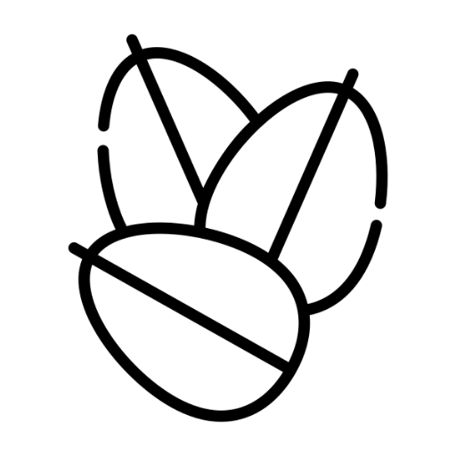

# OpenAlgoTrader | OAT

<p align="center">

</p>

#### An open-source algorithmic trading platform written in Rust

## Intro

OpenAlgoTrader, or OAT, is designed to be an asynchronous platform for algorithmic trading, allowing users to employ multiple strategies at once. By following the Pub/Sub model of messaging, we're able to modularize different aspects of strategies and allow them to be reused by other strategies with very little increase in required computing power.

## Installation

OAT is written in Rust, meaning that it uses `cargo`. Building and running the project is extremely straightforward.


```bash
cargo build
cargo run
```

## Usage

```Eventually there'll be some robust documentation here.```

## Contributing
Please see [CONTRIBUTING.md](CONTRIBUTING.md) for information regarding contribution to OAT.

---

<div align="center" style="font-size:12px;">Icons made by <a href="https://www.freepik.com" title="Freepik">Freepik</a> from <a href="https://www.flaticon.com/" title="Flaticon">www.flaticon.com</a></div>
